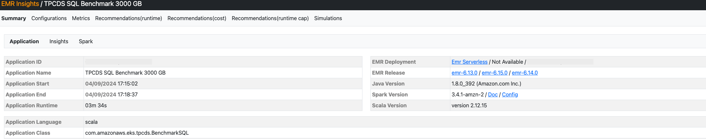
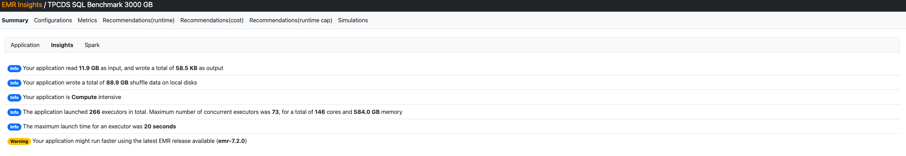

# Amazon EMR Advisor
Started as fork of [Qubole SparkLens](https://github.com/qubole/sparklens), this tool can be used to analyze Spark 
Event Logs to generate insights and costs recommendations using different deployment options for Amazon EMR.

The tool generates an HTML report that can be stored locally or on Amazon S3 bucket for a quick review.

## Requirements
- sbt
- Apache Spark
- AWS Credentials

**Note** If you want to process Spark Event logs stored in an S3 bucket, make sure to add the hadoop-aws libraries in 
the Spark jar path

**Note** In order to create and store reports on S3, you must have valid AWS Credentials. For example, an IAM role
with following permissions if you run this tool on an EC2 instance, or you can configure AWS programmatic keys on your local 
computer using the AWS CLI

```
{
    "Version": "2012-10-17",
    "Statement": [
        {
            "Effect": "Allow",
            "Action": [
                "s3:ListBucket",
                "s3:GetObject",
                "s3:PutObject"
            ],
            "Resource": [
                "arn:aws:s3:::<your-bucket>",
                "arn:aws:s3:::<your-bucket>/*"
            ]
        },
        {
            "Effect": "Allow",
            "Action": [
                "elasticmapreduce:ListReleaseLabels",
                "elasticmapreduce:DescribeReleaseLabel"
            ],
            "Resource": "*"
        },
        {
            "Effect": "Allow",
            "Action": "pricing:GetProducts",
            "Resource": "*"
        }
    ]
}
```

## Usage

1. Compile and build the package

```bash
sbt clean compile assembly
```

2. On an EMR on EC2 or Spark cluster, launch the application using `spark-submit` command

```bash
usage: spark-submit --deploy-mode client --class com.amazonaws.emr.SparkLogsAnalyzer <APP_JAR> [--bucket BUCKET] [--duration DURATION] [--max-executors MAX-EXECUTORS] [--region REGION] [--spot SPOT] <SPARK_LOG>

  APP_JAR                   Insights jar path
  BUCKET                    Amazon S3 bucket to persist HTML reports (e.g my.bucket.name)
  DURATION                  Time duration expected for the job (e.g 15m)
  MAX-EXECUTORS             Maximum number of executors to use in simulations
  REGION                    AWS Region to lookup for costs (e.g. us-east-1)
  SPOT                      Specify spot discount when computing ec2 costs (e.g. 0.7)
  SPARK_LOG                 Spark event logs path. Can process files or directories stored in S3 (s3://), HDFS (hdfs://), or local fs
```

### Public jar file

For easier access, there is a public jar file available at S3.  For example, for version 0.2.0-SNAPSHOT, the file path to jar file is `s3://awslabs-code-us-east-1/EMRAdvisor/aws-emr-insights-assembly-0.2.0-SNAPSHOT.jar`.

To run with `spark-submit`,  include the application jar file as below (version 0.2.0-SNAPSHOT as an example)
```
s3://awslabs-code-us-east-1/EMRAdvisor/aws-emr-insights-assembly-0.2.0-SNAPSHOT.jar
```
The jar file can also be downloaded at `https://awslabs-code-us-east-1.s3.amazonaws.com/EMRAdvisor/aws-emr-insights-assembly-0.2.0-SNAPSHOT.jar`.

### Example - Generate HTML report from a sample spark event log

```bash
spark-submit --deploy-mode client --class com.amazonaws.emr.SparkLogsAnalyzer \
  target/scala-2.12/aws-emr-insights-assembly-0.2.0-SNAPSHOT.jar \
  ./src/test/resources/job_spark_pi
```

To store the report in an Amazon S3 bucket, specify the `--bucket` parameter as well as `--duration` for expected runtime. The tool stores the report on the S3 bucket and generates a pre-signed URL to easily access the report in the browser. For example,

```bash
spark-submit --deploy-mode client --class com.amazonaws.emr.SparkLogsAnalyzer \
  target/scala-2.12/aws-emr-insights-assembly-0.2.0-SNAPSHOT.jar \
  --bucket YOUR_BUCKET_NAME \
  --duration 10m \
  ./src/test/resources/job_spark_pi
```

## Report
The generated report provides a summary of the Spark Application


Insight Tab provides more details and insights 


Three types of recommendations are provided:
* Optimized for **runtime**: improve runtime by increasing parallelism
* Optimized for **cost**: improve cost by increasing resource utilization
* SLA based (**runtime capped**): balance cost and runtime based on the expected runtime specified by `--duration`  


## Security

See [CONTRIBUTING](CONTRIBUTING.md#security-issue-notifications) for more information.

## License

This library is licensed under the MIT-0 License. See the LICENSE file.

