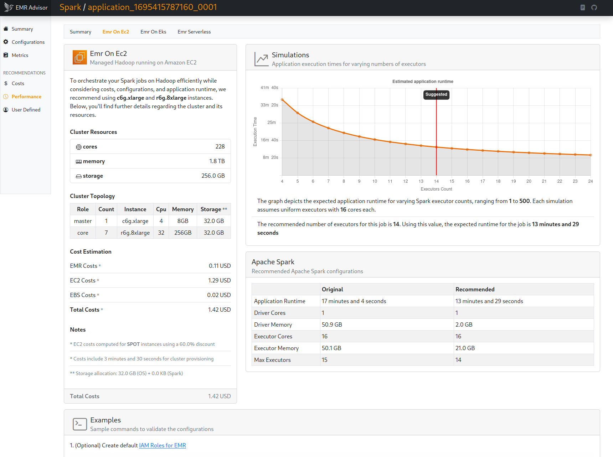

# Amazon EMR Advisor

Originally developed as a fork of [Qubole SparkLens](https://github.com/qubole/sparklens), this tool analyzes Spark Event Logs to provide insights and cost optimization recommendations across various deployment options for Amazon EMR.

It generates an HTML report, which can be saved locally or uploaded to an Amazon S3 bucket for easy access and quick review.

## History

- 2025/06 Release (v0.3.1): Improvements to recommendation logic and bug fixes
- 2025/01 Release (v0.3.0): New Report UI and bug fix
- 2024/08 Release (v0.2.0): Spark Event Log Analysis with EMR deployment recommendations

## Usage

### Requirements

- sbt (Java 17)
- Apache Spark
- AWS Account

**Note** To process Spark Event Logs stored in an S3 bucket, ensure that the `hadoop-aws` libraries are included in the Spark jar path when running the tool on your local machine.

**Note** The application uses AWS services to retrieve additional information (e.g. pricing) to generate the recommendations. Please make sure you have the required [IAM Permissions](./IamPermissions.md) when running the application.

### Build

Compile and build the package locally

```bash
sbt clean compile assembly
```

To build the package on an EMR on EC2 (release >= 7.6.0) cluster: 

```bash
# requirements
export JAVA_HOME=/usr/lib/jvm/java-17-amazon-corretto.x86_64/
export PATH=$JAVA_HOME/bin:$PATH
sudo wget https://www.scala-sbt.org/sbt-rpm.repo -O /etc/yum.repos.d/sbt-rpm.repo
sudo yum -y install git sbt

# clone repo and build
git clone https://github.com/aws-samples/aws-emr-advisor && cd aws-emr-advisor
sbt clean compile assembly
```

### Analyze

Run the application on an EMR on EC2 or Spark cluster using the `spark-submit` command. For specific examples, refer to the corresponding [documentation](./docs/spark.md) pages.

- [Spark Report](./docs/spark.md)
- [Spark Event Logs](./docs/spark_event_logs.md)
- [WIP - Cluster Report](./docs/cluster.md)

## Example Reports

Here are some example reports generated when using the tool.

### Spark Report - EMR Deployment Details



## Security

See [CONTRIBUTING](CONTRIBUTING.md#security-issue-notifications) for more information.

## License

This library is licensed under the MIT-0 License. See the [LICENSE](./LICENSE) file.